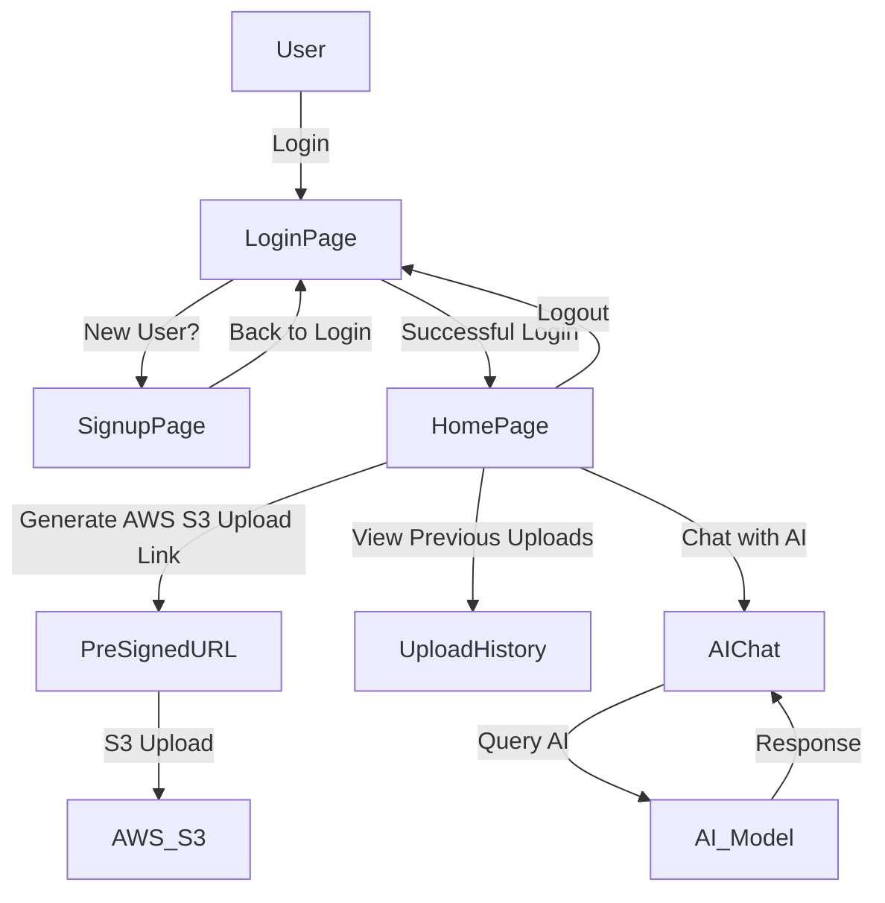

# LabInsight.AI

> **Seamlessly Upload Documents and Query AI for Insights**

## 🚀 Overview

LabInsight.AI is a powerful document processing platform that enables users to **securely upload medical reports via AWS S3** and **query an AI model (Google Gemini)** for insights. The project integrates **Firebase Authentication** for secure login, **AWS S3** for cloud storage, and an AI-powered document chat feature.

## ✨ Features

- 📎 **Secure Document Upload** via temporary pre-signed URLs
- 🔐 **Firebase Authentication** (Google & Email Login)
- 🤖 **AI-powered Document Querying** using Gemini AI
- ☁️ **AWS S3 Integration** for efficient document storage
- ⏳ **Temporary Access Links** (valid for 15 minutes)
- 🖥️ **User-friendly Dashboard** for managing and chatting with documents

---

## 🎥 Demo Video
[](https://www.youtube.com/watch?v=CBM49rZyGTc)

> Click the image above to watch the demo video.

---

## 🏷️ Architecture



---

## 🎨 Design Decisions
### **1️⃣ Firebase Authentication for Secure Login**
- **Why?** Firebase provides **secure, scalable, and easy-to-integrate** authentication.
- **Alternative?** Custom JWT authentication could be used but requires **manual token management**.

### **2️⃣ AWS S3 for Document Storage**
- **Why?** AWS S3 supports **large-scale storage, security, and pre-signed URLs** for controlled uploads.
- **Alternative?** Google Cloud Storage or Firebase Storage, but **S3 offers more granular access controls**.
- **User Context:** Documents are stored in AWS S3 under a dedicated folder for each user, ensuring that if a user returns multiple times, their documents remain accessible in their designated folder.

### **3️⃣ Google Gemini AI for Chat with Documents**
- **Why?** Gemini AI **avoids OpenAI's API limits** and is **optimized for structured document queries**.
- **Alternative?** OpenAI's GPT-4, but it's **costly and has API limits**.

### **4️⃣ Pre-signed URLs for Secure Uploads**
- **Why?** Instead of uploading directly to the backend, users get a **temporary, secure link**.
- **Security Benefit?** Prevents **direct exposure of AWS credentials** to the frontend.

### **5️⃣ `pdf-parse` for Extracting Text from PDFs**
- **Why?** Since Gemini **cannot read files directly**, we extract **raw text** from PDFs and send it to AI.
- **Alternative?** Google Document AI (costly) or Tesseract OCR (for scanned docs).

---

## 🛠️ Tech Stack
| Technology        | Purpose                 |
| ----------------- | ---------------------- |
| **React (Vite)**  | Frontend UI             |
| **Tailwind CSS**  | Styling & Responsive UI |
| **AWS S3**        | Secure Document Storage |
| **Express.js**    | Backend API             |
| **Firebase Auth** | User Authentication     |
| **Google Gemini** | AI Chat Processing      |
| **pdf-parse**     | PDF Text Extraction     |

---

## 📜 Installation & Setup

### **1️⃣ Clone the Repository**
```sh
git clone https://github.com/yourusername/LabInsight.AI.git
cd LabInsight.AI
```

### **2️⃣ Install Dependencies**
```sh
cd frontend && npm install
cd ../backend && npm install
```

### **3️⃣ Setup Environment Variables**
Create a **`.env` file** in the **Backend directory** and configure the following:

```env
AWS_ACCESS_KEY_ID=your_aws_access_key
AWS_SECRET_ACCESS_KEY=your_aws_secret_key
AWS_REGION=your_aws_region
AWS_S3_BUCKET=your_bucket_name
GEMINI_API_KEY=your_google_gemini_api_key
```
**Also, place your `firebase-admin-sdk.json` in the `backend` directory.**

---

Create a **`.env` file** in the **Frontend directory** and configure the following:

```env
VITE_AWS_ACCESS_KEY_ID=your_aws_access_key
VITE_AWS_SECRET_ACCESS_KEY=your_aws_secret_key
VITE_AWS_REGION=your_aws_region
VITE_AWS_S3_BUCKET=your_bucket_name
```

---

### **4️⃣ Run the Application**
```sh
cd backend && node server.js
cd frontend && npm run dev
```

---

## 🚀 Usage Guide
### **1️⃣ Login / Sign Up**
- Sign in with **Google or Email**.
- If you're a **new user**, create an account via **Firebase Authentication**.

### **2️⃣ Upload a Medical Report**
- Click **"Generate Upload Link"** (Valid for 15 minutes).
- Select a **PDF file** and upload it to **AWS S3**.

### **3️⃣ Chat with Your Document**
- Click **"Chat with AI"** on the latest uploaded document.
- Ask questions, and Gemini AI will **summarize or extract insights**.

### **4️⃣ View Previous Uploads**
- Click **"View Previous Uploads"** to see all uploaded documents.
- Click on a file to **download or view it**.

---

## 🛡️ Security Considerations
✅ **Pre-signed URLs** ensure users **can upload files securely** without exposing AWS credentials.  
✅ **Firebase Authentication** prevents **unauthorized access** to documents.  
✅ **AWS S3 Object Permissions** ensure each user **can only access their own files**.  
✅ **Cookies & HTTP-Only Tokens** secure user sessions **without exposing JWTs**.  

---

## 📃 Future Improvements
🔗 **AI-powered Optical Character Recognition (OCR)** – Extract text from **scanned images**.  
🌟 **Multi-file Chat Support** – Compare and analyze **multiple reports** at once.  
🏥 **Doctor Review System** – Allow **doctors to review** AI-generated insights.  
🛡️ **HIPAA Compliance** – Implement **end-to-end encryption** for medical data safety.  

---

## 📝 License
This project is **open-source** under the **MIT License**.

🚀 **Happy coding! Let me know if you have any questions! 🔥**

