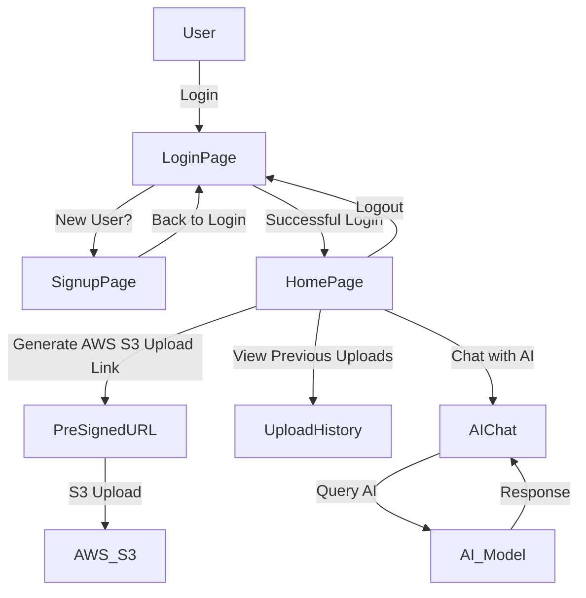

# LabInsight.AI


> **Seamlessly Upload Documents and Query AI for Insights**

## 🚀 Overview

LabInsight.AI is a powerful document processing platform that enables users to securely upload documents via **temporary links** and query an AI model for insights. The project integrates **AWS S3** for storage, **Firebase Authentication** for secure login, and AI-powered document analysis.

## ✨ Features

- 📂 **Secure Document Upload** via temporary pre-signed URLs
- 🔐 **Firebase Authentication** (Google & Email Login)
- 🤖 **AI-powered Document Querying**
- ☁️ **AWS S3 Integration** for efficient document storage
- ⏳ **Temporary Access Links** (valid for 15 seconds)
- 🖥️ **User-friendly Dashboard** for managing documents

## 🛠️ Tech Stack

| Technology        | Usage               |
| ----------------- | ------------------- |
| **React**         | Frontend UI         |
| **AWS S3**        | Document Storage    |
| **Express**       | Backend API         |
| **Firebase Auth** | User Authentication |
| AI-model          | gemini-pro          |

## 🏗️ Architecture



## 📜 Installation

### 1️⃣ Clone the Repository

```sh
git clone https://github.com/yourusername/LabInsight.AI.git
cd LabInsight.AI
```

### 2️⃣ Install Dependencies

```sh
cd Frontend && npm install
cd ../Backend && npm install
```

### 3️⃣ Setup Environment Variables

Create a `.env` file in the Backend directory and configure the following:

```env
AWS_ACCESS_KEY_ID=
AWS_SECRET_ACCESS_KEY=
AWS_REGION=
AWS_S3_BUCKET=
GEMINI_API_KEY=
```

Add your firebase-admin-sdk.json file in Backend directory

Create a `.env` file in the Frontend directory and configure the following:

```env
VITE_AWS_ACCESS_KEY_ID=
VITE_AWS_SECRET_ACCESS_KEY=
VITE_AWS_REGION=
VITE_AWS_S3_BUCKET=
```

### 4️⃣ Run the Application

```sh
cd frontend && npm run dev
cd backend && node server.js
```

